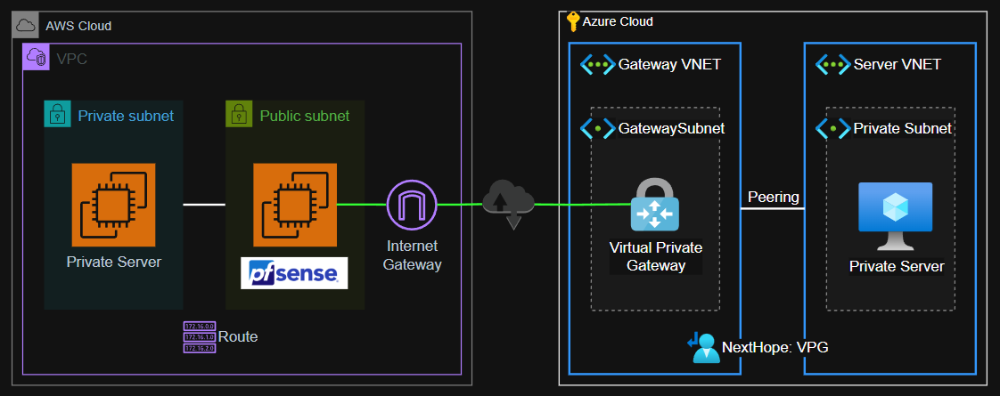

# Azure Site-to-Site VPN

Azure VPN-as-a-Service connection with pfSense.



## 1 - AWS

### 1.1 - Resource Deployment

Copy the configuration file:

```sh
cp aws/config/local.auto.tfvars aws/.auto.tfvars
```

Use a secure login mechanism, such as AWS CLI with SSO:

```sh
export AWS_PROFILE=<profile>
aws sso login
```

Create the resources:

```sh
terraform -chdir="aws" init
terraform -chdir="aws" apply -auto-approve
```

### 1.2 - Configure pfSense

Connect to pfSense and setup IPSec:

> [!NOTE]
> Get the password from the `pfsense-firewall` instance EC2 system log (can take a while to appear)

- Username: admin
- Password: <system log password>

To be compatible with Azure Virtual Gateway, use [IPSec Site-to-Site VPN with Pre-Shared Keys][ipsec-s2s-psk].


| 


## 2 - Azure Deployment

General configuration can be based off of [this article][azure-s2s-vpn-tutorial].

Start by creating the temporary keys for SSH authentication:

```sh
mkdir azure/.keys && ssh-keygen -f azure/.keys/tmp_rsa
```

Copy the variables file:

```sh
cp azure/config/local.auto.tfvars azure/.auto.tfvars
```

Set the required values:

> [!TIP]
> You can get your current IP with `curl ifconfig.me`

Get the `pfSense` public IP from the `pfsense_firewall_host_elastic_public_ip` output.

```terraform
subscription_id            = "<SUBSCRIPTION_ID>"
public_ip_address_to_allow = ["<YOUR_IP>"]
```

Create the infrastructure:

```sh
terraform -chdir="azure" init
terraform -chdir="azure" apply -auto-approve
```

## 3 - Connection

In the **Azure** variables file, set the require parameters to create the tunnel:

```terraform
create_vpn_connection = true
lgw_gateway_address   = "<PFSENSE_PUBLIC_IP>"
vcn_shared_key        = "<SHARED_KEY>"
```

[azure-s2s-vpn-tutorial]: https://learn.microsoft.com/en-us/azure/vpn-gateway/tutorial-site-to-site-portal
[ipsec-s2s-psk]: https://docs.netgate.com/pfsense/en/latest/recipes/ipsec-s2s-psk.html
